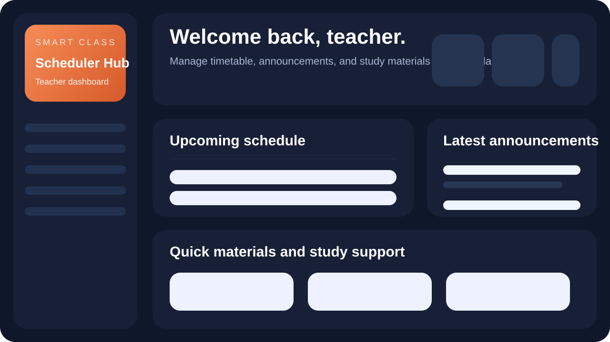
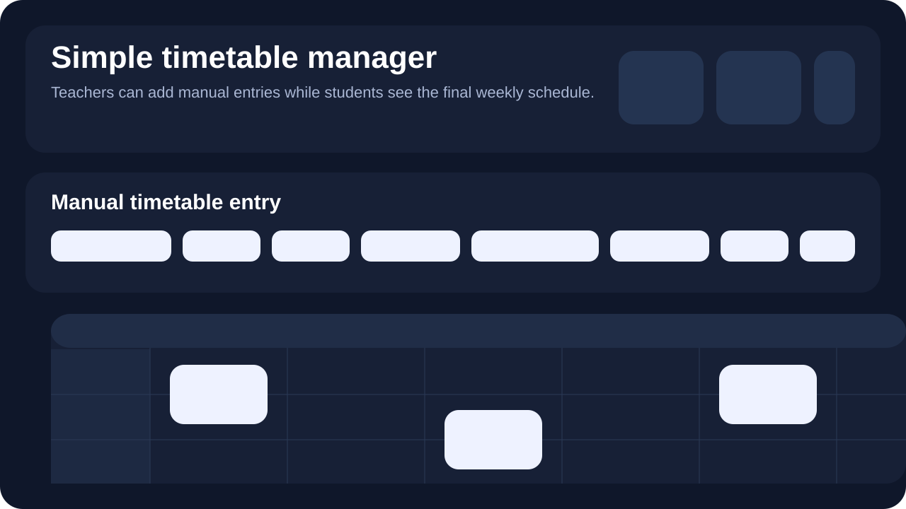
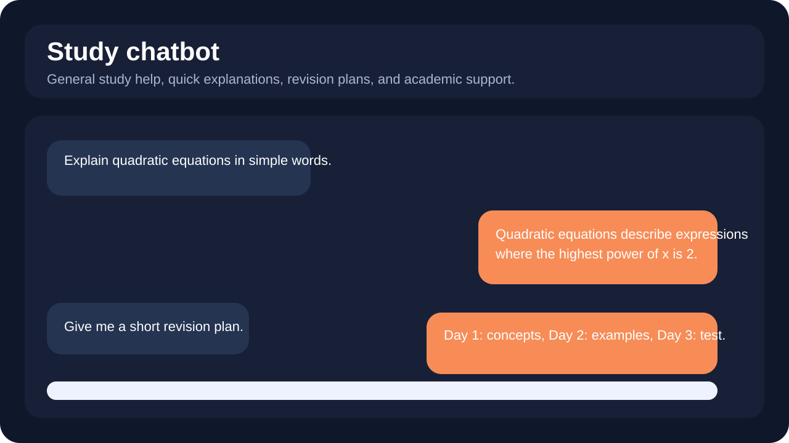

# Smart Class Scheduler

Teacher-first timetable management platform with a clean student view, study material sharing, announcements, and chatbot support.

## Live Demo

- App: [https://smart-class-scheduler-eight-beta.vercel.app](https://smart-class-scheduler-eight-beta.vercel.app)
- Deployment: [https://smart-class-scheduler-adhler7sa.vercel.app](https://smart-class-scheduler-adhler7sa.vercel.app)
- GitHub: [https://github.com/reetikkumar736997-ai/smart-class-scheduler](https://github.com/reetikkumar736997-ai/smart-class-scheduler)

## Project Description

Smart Class Scheduler is a full-stack academic management app built for a simple two-role workflow:

- Teachers manage the timetable, announcements, and study materials.
- Students view the final timetable and access shared learning resources.

The project was designed to remove timetable confusion by making the teacher the single source of truth, while keeping the student experience simple, fast, and easy to use.

## Screenshots

### Dashboard Preview



### Timetable Preview



### Chatbot Preview



## Core Features

- Role-based login for teachers and students
- Teacher-managed manual timetable creation
- Student-facing final timetable view
- Announcements posting, editing, and deletion
- PDF study material upload and download
- Rule-based academic chatbot for study help
- Light mode and dark mode toggle
- Responsive interface for desktop and mobile
- Persistent cloud-backed data with database and file storage

## Tech Stack

- Next.js 16
- React 19
- TypeScript
- Prisma ORM
- Supabase Postgres
- Supabase Storage
- Vercel

## Demo Credentials

- Teacher: `teacher@smartclass.edu` / `teacher123`
- Student: `student@smartclass.edu` / `student123`

## Portfolio Bullet Points

- Built and deployed a full-stack Smart Class Scheduler using Next.js, React, TypeScript, Prisma, Supabase Postgres, Supabase Storage, and Vercel.
- Designed a teacher-first timetable workflow where teachers manually manage classes, sections, rooms, subjects, and periods while students view the final schedule.
- Implemented role-based authentication, announcements management, PDF material uploads, and a rule-based academic chatbot in a responsive UI.
- Migrated the app from in-memory demo data to persistent cloud-backed storage and completed production deployment with environment configuration and database sync.

## Resume Description

Built and deployed a full-stack Smart Class Scheduler web application for teachers and students using Next.js, React, Prisma, PostgreSQL, Supabase, and Vercel. Implemented role-based login, teacher-managed timetable creation, announcements, study material uploads, dark/light mode, and a rule-based academic chatbot.

## Local Setup

1. Install dependencies:

```bash
npm install
```

2. Add environment variables in `.env.local`:

```env
SUPABASE_URL=your_supabase_project_url
SUPABASE_ANON_KEY=your_supabase_publishable_key
SUPABASE_SERVICE_ROLE_KEY=your_supabase_service_role_key
SUPABASE_BUCKET=materials
DATABASE_URL=your_supabase_pooling_connection_string
DIRECT_URL=your_supabase_direct_connection_string
```

3. Generate Prisma client:

```bash
npm run db:generate
```

4. Push the schema:

```bash
npm run db:push
```

5. Start the development server:

```bash
npm run dev
```

## Production Setup

The app is deployed on Vercel and uses:

- Supabase Postgres for persistent application data
- Supabase Storage for uploaded materials
- Prisma for type-safe database access
- Vercel environment variables for production configuration

## Suggested Resume Project Title

**Smart Class Scheduler | Next.js, TypeScript, Prisma, Supabase, Vercel**
